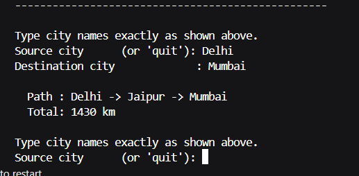

# AI Assignment - 3

## Algorithms Implemented

- Dijkstra’s Algorithm (Uniform Cost Search)  
- A* Search Algorithm  
- Repeated A* (Dynamic Replanning)  

---

## Project Files

- `dijkstra.py` → Shortest path between cities  
- `edge_list.csv` → City distance dataset  
- `static_ugv.py` → UGV with static obstacles  
- `dynamic_ugv.py` → UGV with dynamic obstacles  

---

## 1. Dijkstra (Cities)

Finds the shortest path between Indian cities using real-world distances.

- Graph represented using adjacency list  
- Data loaded from CSV  
- Uses priority queue (min heap)  

**Example Output:**

---

## 2. Static UGV (A*)

UGV navigates a fixed grid environment.

- Grid size: 70 × 70  
- Obstacle density: Low, Medium, High  
- Movement: 8 directions  
- Uses A* for optimal pathfinding  

**Metrics:**
- Path Length  
- Efficiency  
- Nodes Expanded  
- Execution Time  

---

## 3. Dynamic UGV (Repeated A*)

UGV navigates in a changing environment.

- Obstacles update dynamically  
- Replans path when blocked  
- Uses Repeated A*  

---

